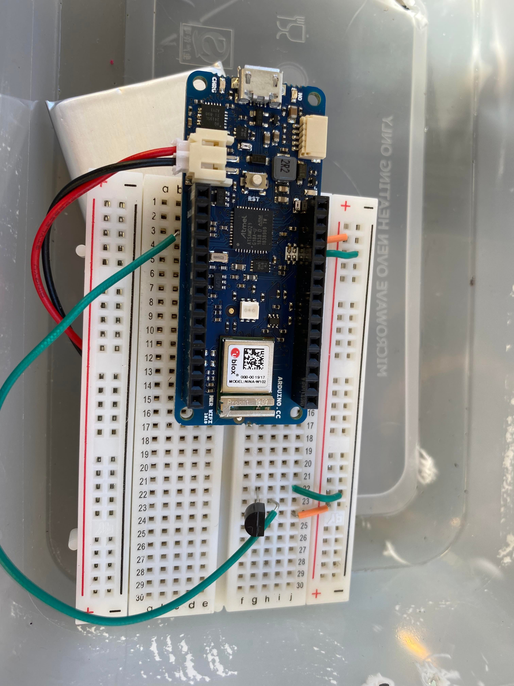

# Tutorial for building a simple arduino based temperature sensor.

Yohalmo Daniel Martinez Lara - ym222cw

## Description

In this tutorial we will build a simple temperature communicator IOT device that will be reading the room temperature and save the data to MongoDB through our external api, which we will reach by connecting the IOT device to the wifi. The data will be presented with the help of our external API that will be saving and serving the data. In this case we will use our own created frontend with nextjs framework that will fetch and present the data saved to MongoDB.

Estimated time needed: 2-3h.

## Objective

The reason for this procject is becase we are a big family and we often use to much energy on heating our rooms. With this iot device we will be able to monitor the temperature of the main room in the house, so that we do not spend to much energy on heating it up.

The main purpose for this procject is to learn the basics of the world of IOT devices and how they can provide information from the real world. By creating this simple procject I believe that we will be able to gain some basic knowledge about the different workflows of IOT devices and the way we save / present the data by connecting the device to the internet.

When I complete the project I will be able to understand the different ways of reading live data, from IOT devices. In this case, we will read the temperature of a room with the help of a temperature sensor. We will have created a self-sustained IOT device that will read information on a daily basis and save that data. With the way we save the data, we will be able to view the most recent data. Altought this project is simple, it gives the posibility to add extra features add further imporvements.

## Material

The required materials for the project are all included in the [Electrokit](http://www.electrokit.com) Arduino mkr1000 boundle. In this tutorial we will be using the mkr1010 wifi, but the provided mkr1000 will work aswell.

The folloing are the required materials for the project:
|Component|Store|Price| description|
|----|----|----|----|
|[Arduino boundle](https://www.electrokit.com/produkt/arduino-mkr-iot-bundle/)|Electrokit|995 SEK| Arduino boulde with all essential components.|
|Arduino mkr1000 or mkr1010|[Arduino boundle](https://www.electrokit.com/produkt/arduino-mkr-iot-bundle/)| Included | Board with wifi capabilities. Li-Po Single Cell, 3.7V, 1024mAh compatible. Programmable with c++|
|TMP36 temperature sensor|[Arduino boundle](https://www.electrokit.com/produkt/arduino-mkr-iot-bundle/)| Included | Sensor for reading temperature from the plant.|
|Breadboard|[Arduino boundle](https://www.electrokit.com/produkt/arduino-mkr-iot-bundle/)| Included | Solderless base for board and sensors.|
|USB-cable|[Arduino boundle](https://www.electrokit.com/produkt/arduino-mkr-iot-bundle/)| Included | Cable to connect board to computer or for charging.|
|[3,7 V - Li-Po battery](https://www.kjell.com/se/produkter/el-verktyg/arduino/arduino-tillbehor/luxorparts-li-po-batteri-37-v-med-kontakt-1200-mah-p87924?gclid=CjwKCAjw4ayUBhA4EiwATWyBrgnLGLbsof9aGo4WD07YLEEVemxWHd9v1mQaABOOYs8kAGj06HmD_RoCZegQAvD_BwE&gclsrc=aw.ds)|https://www.kjell.com/|99.90 SEK| Battery for the board. This is optional but recommended if the device will be outside.|

Total cost: 1095.90 (including the Li-Po battery).

mkr1010 board:
`This board is powerful enough for the project and has all necessary capabilities in order to complete the project.`


## Computer setup

Required software:

- Arduino IDE - For easier dependency management.
- C++ - Required for Arduino borad (included in the Arduino IDE)
- OS - Windows 11 or other popular OS.

<br>
<br>
The chosen IDE is Arduinos own IDE for development of arduino boards. This IDE includes all dependencies needed in order to compile C++ code and flash the Arduino board. So there won't really be any need to install other software for flashing or uploading the code.
<br>
<br>
The first step in the process is to install the IDE from Arduino. This will be used to flash the board and controll dependecies like external libraries.
<br>
<br>
Follow the following link in order to install the correct IDE: [Arduino IDE - istall guide](https://www.arduino.cc/en/software)
<br>
<br>
After successfully installing the IDE we need to install the SAMD CORE. This is done by opening the Arduino IDE and following these steps:

`Tools > Board > Board Manager > search for "samd" > install Arduino SAMD Boards (32-bits ARM Cortex-M0+) `

<br>
<br>
<br>
We are now ready to select the board that we will be working with.
Follow the next steps to set the board:

`Tools > Board > Arduino SAMD Boards (32-bits ARM Cortex-M0+) > Select "Arduino mkr1000" or "mkr1010"`

<br>
<br>
<br>
Now we are ready to connect our board to the IDE! Start by connecting the USB to your computer and board.
In order for the IDE to find a board on a given port, we will need to select a board connected to a specific port.

`Tools > Port > Select the available board connected to a port.`

<br>
<br>
<br>
We now have a board connected to the IDE and we are ready to upload our code!

`Arduino IDE provides a simple way of flashing and oploading a new sketch to the board:`


`Note! The previous mentioned software and instructions are specific to windows 11 users, however these instructions and software should be suported by most popular OS but may look a bit different, depending on your OS. Just follow the provided links and you'll find the correct instructions for your OS.`
<br>
<br>
<br>

### Optional

If you've bought the battery, make sure to connect it to the boards JST connector. You will have to let the board stay connected to the USB as the battery needs to be charged. When you are ready for the IOT device to sustain it self on the battery, make sure to flash the board and load the new sketch (code) and remove the USB. It will then start using the battery.

The following diagram demonstrates how the Li-Po battery should be connected to the board.


## Putting everything together

Start by connecting the board to the breadboard. Then we will need the TMP36 temperature sensor. Connect the two jumper wires on the power rail of the breadboard, infront of the sensor. Finaly connect the TMP36 temperature (`P23`) sensor to the board (pin `A2`) with a larger jumper wire, just as shown in the image below.

The TMP36 sensor is a low voltage sensor and we won't have to make an advance calibration.

To get convert the voltage to celcius we will need to multiply the sensor reading by 3.3 (given the fact that the borad is of 3.3V), to convert the reading to voltage.

Then we need to devide the voltage with with 1024 formula.
To get the
Formula: milliVolts = (reading from ADC) \* (3300/1024)

Finaly we convert the milliVolts to celcius with the formula: [(analog voltage in mV) - 500] / 10

See the following code to get a better picture of how we calibrate the reading into celcius.

```cpp

 int reading = analogRead(tempPin);
 float voltage = reading * 3.3;
 voltage /= 1023.0;
 float temperatureC = (voltage - 0.5) * 100 ; //converting to C.

```



`Note! You might have to force the TMP36 temperature sensor pins to the connect it to the breadboard since they are to straight by default and need a bit of bending.`

## Platform

Before starting to code, I did some reserach on possible platforms that could be used for the project. However, most of them did not satisfy what I was looking for. The reason for this was that I had a few issues when I tried to connect the IOT to multiple platforms. I had some connectivity issues when trying to connect to multiple hosts and I just did not like the IOT device being directly communicating with these platforms (ex. ThingsSpeak or InfluxDB). I also did not want the IOT device to have a direct dependency on these platforms, in case I want to change them in the future. Therefore most of the services used on this project I did create myself. For example, the API and visualization are both created from scratch by me.

The only external platform used where MongoDB atlas (database) and Zapier (email service provider). I am familiar with MongoDB atlas (cloud) and creating a collection and connecting it to the project was not hard, so this was a perfect solution for how I will be storing data. Zapier was also easy to use. The IOT device does not communicate directly with these services, that is the job of the API. Even though I haven't used Zapier previously, it wasn't hard to get used to it. Zapier is an email service provider and it is easy to register hooks to it. When the IOT device sends a email notice request to the API, the API will send a request to Zapier hook url and it will triger an email event.

The versions used of these two external platforms are both the free versions. This makes it harder to store large sums of data, but for the amount of data that I will be saving, these versions are fine. For the MongoDB, I will only be storing 24 documents each day, and deleting the old data from the day before. The IOT will only triger when the temperature is to hot, so the 100 free emails / months that Zapier provides are more than enough for this project.

In the future, it will be easy to upgrade the subscriptions of the previous mentioned platforms, change these platforms for other services or change functionality. This will be easier to do for the simple fact that the IOT is not directy dependent on these platforms. All the logic is on the API and it can easly be replaced.

## The code

The following code bits are the most important parts of the code. The WiFiNINA library is used to connect the Thing directly the wifi. The Base64 library is used to base 64 encode the credentials required by the API and is used by the `send_message` function, that is responsible for sending messages to the API I created with the help of the WiFiSSLClient library. This function uses sub functions to load all the required information, like the `get_temperature` function.

The `get_temperature` is responsible for reading the values of the temperature sensor. It will read the values and calibrate them in order for the iot to then send that data.

For the internet connectivity, I used WiFiSSLClient library which helps us connect to the desired wifi network. It will use this wifi connectivity to send the data over HTTPS to our api endpoint.

`Note! For security reasons, the network the Thing connects to is created specific for the Thing and is separate from the one the rest of us use.`

```cpp
#include <ArduinoLowPower.h>
#include <Base64.h>
#include <WiFiSSLClient.h>

// Func to connnect to wifi.
void connectWifi(){

 while (WiFi.begin(ssid, password) != WL_CONNECTED) {
   Serial.print(".");
   // Set wifi to low power mode.
   WiFi.lowPowerMode();
   delay(500);
 }
 Serial.println("");
 Serial.println("WiFi connected");
  }


// Func to send message to api.
void send_message(String waring) {
  // Make sure connection is closed before initiating a new one.
 client.stop();
  // Check wifi status. If disconnected, connect to it.
  if (WiFi.status() != WL_CONNECTED) {
     connectWifi();
    }
 // Get all information needed.
   String _temperature = String(get_temperature());
   String _warning = waring;
   String authString = getAuthToken();

   // Connect to host.
 if (client.connect(host, 443)) {
   client.println("POST "+url+"?"+"temp="+_temperature+"&warning="+_warning+" HTTP/1.1");

   client.println("Authorization: Basic " + authString);
   client.println("Host: " + String(host));
   client.println("Connection: close");

   client.println();
   delay(1000);
   while (client.available()) { // Print answer from the request.
     char c = client.read();
     Serial.write(c);
   }
   client.stop();  // Disconnect from the server

   Serial.println("Message sent");
 }
 else {
   Serial.println("Failed to connect to client - message");
 }
}


// Func to get temperature in celsius format.
float get_temperature() {
 int reading = analogRead(tempPin);
 float voltage = reading * 3.3;
 voltage /= 1023.0;
 float temperatureC = (voltage - 0.5) * 100 ; //converting to C.
 return temperatureC;
}


```

## Data flow / Connectivity

For this project I decided to go with wifi connectivity. Given the nature of the project, we do not need constant live data and store much information. This is why the IOT device reads the sensor data and then uses HTTPS as its transport protocol to send the data to the API once every hour. The data is sent as parameters in the URL because I wanted to keep the sketch simple and not to large.

Another reason for not sending data more often is because the Thing is battery powered and would run out of battery fast. Between each request the Thing goes back to sleep for an hour and sets on low power mode on all operations and the wifi connectivity, for extendend battery life.

## Presenting the data

For this part I decided to create my own visualization app with Nextjs. This because I wanted to make it a bit more challenging but also because I do not want the Thing to have direct communication to the front-end or the other services used. The way I have decided to present the data is that I present only the latest data.

Here we can see the latest data showing the latest temperature.


The API saves the new data on every request recived from the IOT device to MongoDB atlas. As stated previously, I do not want the Thing to have a dependency to these external platforms, which is why I decided to go with mongodb being controlled by the API. It will also check and delete data that was preciously saved, since I do not believe that old data is necessarly important for a project of this type.

## Finalizing the design

I am happy about the way I structured the project and with my own implementation of all different services used. If I had to do something differently, I would've bought or created a case for the Thing. The project is very simple but it is a good start and could be developed further in the future.

All in all, I am happy to have had the opportunity to learn about IOT devices and different ways of actualy combine the knowledge I have with new ways of collecting data.


<br>
<br>
